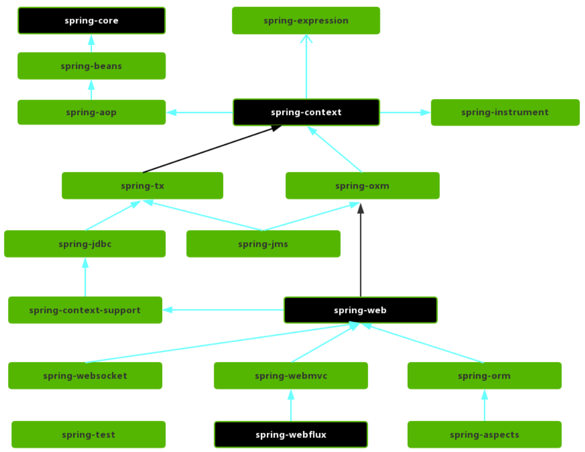
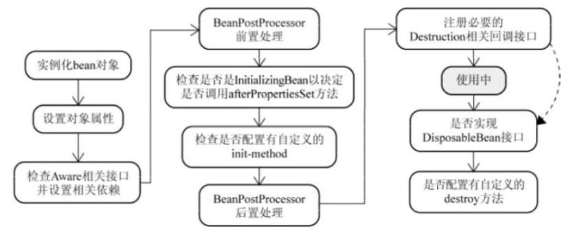
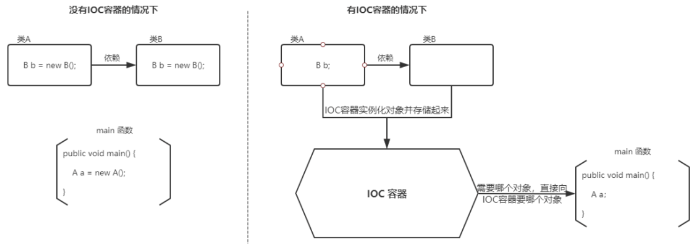
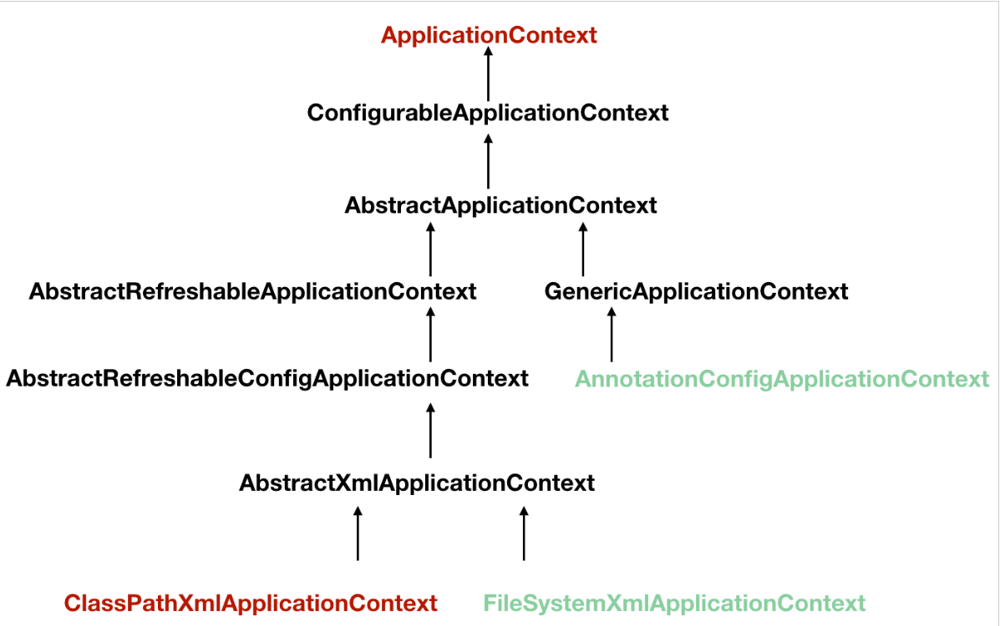
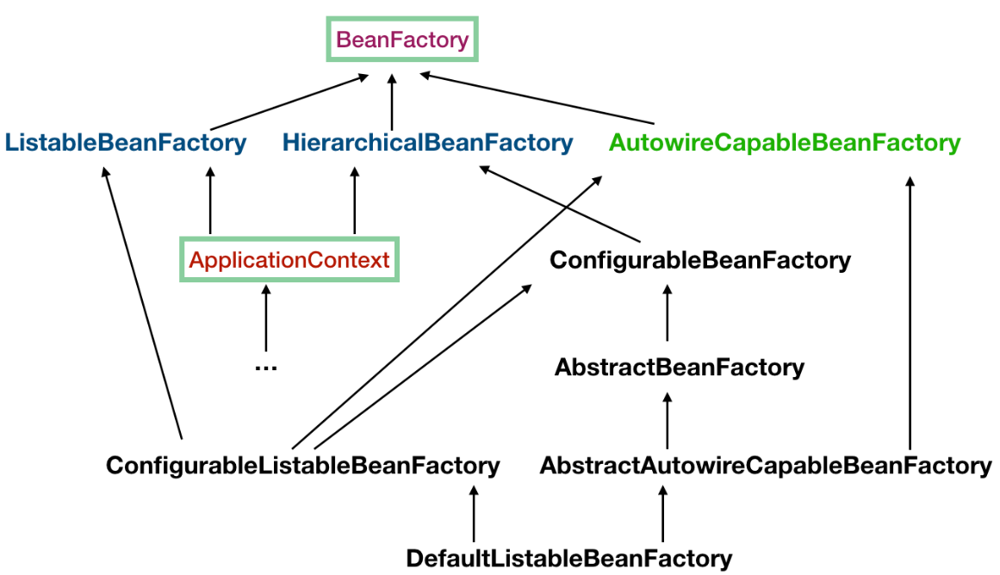
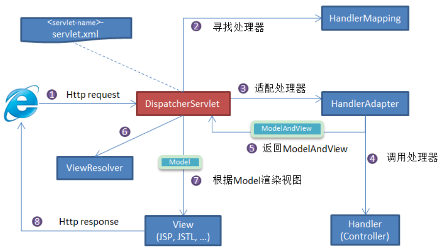

# spring


## 基础知识


### 概述

Spring 最核心的思想就是不重新造轮子，开箱即用，提高开发效率。

### 模块

Spring 各个模块的依赖关系如下：




#### Core Container

- spring-core：Spring 框架基本的核心工具类。
- spring-beans：提供对 bean 的创建、配置和管理等功能的支持。
- spring-context：提供对国际化、事件传播、资源加载等功能的支持。
- spring-expression：提供对表达式语言（Spring Expression Language） SpEL 的支持，只依赖于 core 模块，不依赖于其他模块，可以单独使用。

#### AOP

- spring-aspects：该模块为与 AspectJ 的集成提供支持。
- spring-aop：提供了面向切面的编程实现。
- spring-instrument：提供了为 JVM 添加代理（agent）的功能。 具体来讲，它为 Tomcat 提供了一个织入代理，能够为 Tomcat 传递类文 件，就像这些文件是被类加载器加载的一样。没有理解也没关系，这个模块的使用场景非常有限。

#### Data Access/Integration

- spring-jdbc：提供了对数据库访问的抽象 JDBC。不同的数据库都有自己独立的 API 用于操作数据库，而 Java 程序只需要和 JDBC API 交互，这样就屏蔽了数据库的影响。
- spring-tx：提供对事务的支持。
- spring-orm：提供对 Hibernate、JPA、iBatis 等 ORM 框架的支持。
- spring-oxm：提供一个抽象层支撑 OXM(Object-to-XML-Mapping)，例如：JAXB、Castor、XMLBeans、JiBX 和 XStream 等。
- spring-jms : 消息服务。自 Spring Framework 4.1 以后，它还提供了对 spring-messaging 模块的继承。

#### Spring Web

- spring-web：对 Web 功能的实现提供一些最基础的支持。
- spring-webmvc：提供对 Spring MVC 的实现。
- spring-websocket：提供了对 WebSocket 的支持，WebSocket 可以让客户端和服务端进行双向通信。
- spring-webflux：提供对 WebFlux 的支持。WebFlux 是 Spring Framework 5.0 中引入的新的响应式框架。与 Spring MVC 不同，它不需要 Servlet API，是完全异步。


### 事务

#### 事务机制

- spring支持编程式事务管理和声明式事务管理两种方式：
  - 编程式事务管理使用TransactionTemplate
    或者直接使用底层的PlatformTransactionManager
    spring推荐使用TransactionTemplate
  - 声明式事务管理建立在AOP之上的
    其本质是对方法前后进行拦截 然后在目标方法开始之前创建或者加入一个事务
    声明式事务管理也有两种常用的方式：
    - `基于tx和aop名字空间的xml配置文`件
    - 基于`@Transactional`注解

spring所有的事务管理策略类都继承自org.springframework.transaction.PlatformTransactionManager接口
@Transactional 注解应该只被应用到public方法上  这是由Spring AOP的本质决定的
只有来自外部的方法调用才会被AOP代理捕获，也就是，类内部方法调用本类内部的其他方法并不会引起事务行为，即使被调用方法使用@Transactional注解进行修饰


#### 注解开发

spring 的事务管理 其实也就是对数据库事务功能的支持
直接在类或方法上添加 @Transactional() 注解 即可实现注解开启
需要注意的是：

- 如果被注解的数据库操作方法中发生了unchecked异常  所有的数据库操作将rollback
- 如果发生的异常是checked异常  默认情况下数据库操作还是会提交的

最重要的是  要理解spring事务管理的机制：`使用AOP在需要事务管理的方法前后添加事务开启关闭提交的逻辑`  明白了这个逻辑 也就能理解spring的事务机制


#### 传播机制

- PROPAGATION_REQUIRED —— 支持当前事务，如果当前没有事务，则新建一个事务，这是最常见的选择，也是 Spring 默认的一个事务传播属性。
- PROPAGATION_SUPPORTS —— 支持当前事务，如果当前没有事务，则以非事务方式执行。
- PROPAGATION_MANDATORY —— 支持当前事务，如果当前没有事务，则抛出异常。
- PROPAGATION_REQUIRES_NEW —— 新建事务，如果当前存在事务，把当前事务挂起。
- PROPAGATION_NOT_SUPPORTED —— 以非事务方式执行操作，如果当前存在事务，就把当前事务挂起。
- PROPAGATION_NEVER —— 以非事务方式执行，如果当前存在事务，则抛出异常。
- PROPAGATION_NESTED —— Nested的事务和它的**父事务**是相依的，它的提交是要等和它的父事务一块提交的。


#### 隔离级别

1、ISOLATION_DEFAULT
这是一个 PlatfromTransactionManager 默认的隔离级别，使用数据库默认的事务隔离级别。
以下4个与 JDBC 的隔离级别相对应。

2、ISOLATION_READ_UNCOMMITTED
这是事务最低的隔离级别，它允许另外一个事务可以看到这个事务未提交的数据。
这种隔离级别会产生脏读，不可重复读和幻读。

3、 ISOLATION_READ_COMMITTED
保证一个事务修改的数据提交后才能被另外一个事务读取，其它事务不能读取该事务未提交的数据。
这种事务隔离级别可以避免脏读出现，但是可能会出现不可重复读和幻像读。

4、ISOLATION_REPEATABLE_READ
保证一个事务不能读取另一个事务未提交的数据，避免了“脏读取”和“不可重复读取”的情况，但是带来了更多的性能损失。
这种事务隔离级别可以防止脏读，不可重复读，但是可能出现幻读。

5、ISOLATION_SERIALIZABLE
这是最可靠的但是代价花费最高的事务隔离级别，事务被处理为顺序执行。
除了可防止脏读，不可重复读外，还避免了幻读。


## 常用注解

### 装配bean注解

1. @Component ：标准一个普通的spring Bean类

2. @Repository：标注一个DAO组件类

3. @Service：标注一个业务逻辑组件类

4. @Controller：标注一个控制器组件类

   `这些都是注解在平时的开发过程中出镜率极高，@Component、@Repository、@Service、@Controller实质上属于同一类注解，用法相同，功能相同，区别在于标识组件的类型。 @Component可以代替@Repository、@Service、@Controller，因为这三个注解是被@Component标注的`

(装配的时候需要注意装配的方法 根据类型或者根据名称)

1. @Autowired：属于Spring 的org.springframework.beans.factory.annotation包下,可用于为类的属性、构造器、方法进行注值 

2. @Qualifier：经常使用的Autowired 默认使用的装配方式是byType  而在项目中存在同名的类的时候会出现问题 因为默认的命名方式会导致出现重名的bean这里就需要使用到byName的装配方式

3. @Primary：这个注解也是出现在存在重名bean的时候  不过不同于上面两个注解 这个注解是用来标注 优先使用的 标记了这个注解的bean将会被优先使用到

4. @Resource：`不属于spring的注解`，而是来自于JSR-250位于java.annotation包下，使用该annotation为目标bean指定协作者Bean。 

5. @PostConstruct 和 @PreDestroy 方法 实现初始化和销毁bean之前进行的操作

6. @Configuration：

   1. `Spring的官方团队说@Component可以替代@Configuration注解`  查看源码可知
   2. 虽说在代码逻辑上组件注解可以代替配置注解  但是实际上 我们在标有配置注解的类中对 对象定义实例、配置和初始化逻辑
   3. 视图解析器AOP事务管理器之类.... 在配置类中管理的基本都是第三方的类

7. @Bean：

   bean注解基本作用于方法之上 用来处理第三方的类  一般是在配置类中处理 一些特定的第三方类  如视图解析、事务管理、监听等等...


### Spring AOP注解

1. @Aspat 切面
2. @Pointcut 切点
3. @Before — 前置通知
4. @AfterReturning — 后置通知
5. @Around — 环绕通知（目标对象默认不执行，需要手动执行）
6. @After — 最终通知
7. @AfterThrowing — 异常抛出通知
8. @EnableAspectJAutoProxy 启用注解

不同版本spring的通知顺序也不一样

`spring4,@After在@AfterReturning或@AfterThrowing前面`

`spring5,@After在@AfterReturning或@AfterThrowing后面`

`spring4的正常顺序, @Around环绕通知将@Before包裹起来,之后是@After和@AfterReturning`

`spring5的正常顺序, @Around环绕通知将@Before、@AfterReturning和@After包裹起来`


### Spring MVC模块注解

1. @Controller：表明该类会作为与前端作交互的控制层组件
2. @RequestMapping：这个注解用于将url映射到整个处理类或者特定的处理请求的方法
3. @RequestParam：将请求的参数绑定到方法中的参数上
4. @PathVariable：该注解用于方法修饰方法参数 会将修饰的方法参数变为可供使用的uri变量
5. @RequestBody：@RequestBody是指方法参数应该被绑定到HTTP请求Body上
6. @ResponseBody： 作用是将返回类型直接输入到HTTP response body中 `@ResponseBody在输出JSON格式的数据时 会经常用到`
7. @RestController： 控制器实现了REST的API 只为服务于JSON，XML或其它自定义的类型内容
8. @ModelAttribute：


### Spring事务模块注解

1. @Transactional：在处理dao层或service层的事务操作时  譬如删除失败时的回滚操作

   spring 的事务管理 其实也就是对数据库事务功能的注解支持(通过注解实现数据库事务功能)


### 其他注解

1. @NonNull可以标注在方法、字段、参数之上，表示对应的值不可以为空
2. @Nullable注解可以标注在方法、字段、参数之上，表示对应的值可以为空


## Bean

### 作用域

1. singleton：单例模式
2. prototype：原型
3. request: 对于一次HTTP请求
4. session：针对http session起作用
5. global session：限定一个Bean的作用域为全局HTTPSession的生命周期
6. application：限定一个Bean的作用域为ServletContext的生命周期

`Spring默认使用singleton作用域`

### Bean注入

| Annotaion    | Package                            | Source       |
| ------------ | ---------------------------------- | ------------ |
| `@Autowired` | `org.springframework.bean.factory` | Spring 2.5+  |
| `@Resource`  | `javax.annotation`                 | Java JSR-250 |
| `@Inject`    | `javax.inject`                     | Java JSR-330 |

`Autowired` 默认的注入方式为`byType`
`@Resource`默认注入方式为 `byName`

### 生命周期

- Bean 容器找到配置文件中 Spring Bean 的定义。
- Bean 容器利用 Java Reflection API 创建一个 Bean 的实例。
- 如果涉及到一些属性值 利用 `set()`方法设置一些属性值。
- 如果 Bean 实现了 `BeanNameAware` 接口，调用 `setBeanName()`方法，传入 Bean 的名字。
- 如果 Bean 实现了 `BeanClassLoaderAware` 接口，调用 `setBeanClassLoader()`方法，传入 `ClassLoader`对象的实例。
- 如果 Bean 实现了 `BeanFactoryAware` 接口，调用 `setBeanFactory()`方法，传入 `BeanFactory`对象的实例。
- 与上面的类似，如果实现了其他 `*.Aware`接口，就调用相应的方法。
- 如果有和加载这个 Bean 的 Spring 容器相关的 `BeanPostProcessor` 对象，执行`postProcessBeforeInitialization()` 方法
- 如果 Bean 实现了`InitializingBean`接口，执行`afterPropertiesSet()`方法。
- 如果 Bean 在配置文件中的定义包含 init-method 属性，执行指定的方法。
- 如果有和加载这个 Bean 的 Spring 容器相关的 `BeanPostProcessor` 对象，执行`postProcessAfterInitialization()` 方法
- 当要销毁 Bean 的时候，如果 Bean 实现了 `DisposableBean` 接口，执行 `destroy()` 方法。
- 当要销毁 Bean 的时候，如果 Bean 在配置文件中的定义包含 destroy-method 属性，执行指定的方法。




## IOC

### 概念

IoC（Inversion of Control:控制反转） 是一种设计思想，而不是一个具体的技术实现。
IoC 的思想就是将原本在程序中手动创建对象的控制权，交由 Spring 框架来管理。

- **控制**：指的是对象创建（实例化、管理）的权力
- **反转**：控制权交给外部环境（Spring 框架、IoC 容器）



在 Spring 中， IoC 容器是 Spring 用来实现 IoC 的载体， IoC 容器实际上就是个 Map（key，value），Map 中存放的是各种对象。
Spring 中的 IoC 的实现原理就是工厂模式加反射机制
构造器循环依赖问题是无法解决的  属性的循环依赖是可以通过三级缓存解决的


### 源码分析

参考博客：[Spring IOC 容器源码分析]([Spring IOC 容器源码分析_Javadoop](https://javadoop.com/post/spring-ioc))


#### 创建 Bean 容器

##### ApplicationContext

了解SpringIOC 第一个要接触的就是ApplicationContext
ApplicationContext 启动过程中 会负责创建实例 Bean 往各个 Bean 中注入依赖等

下图是ApplicationContext接口的体系结构


常用的ApplicationContext实现

1. FileSystemXmlApplicationContext 的构造函数需要一个 xml 配置文件在系统中的路径
2. ClassPathXmlApplicationContext 的构造函数需要一个 xml 配置文件在ClassPath中的路径
3. AnnotationConfigApplicationContext 是基于注解来使用的 不需要配置文件


##### BeanFactory

BeanFactory 是生产 bean 的工厂  负责生产和管理各个 bean 实例
上面说的ApplicationContext其实就是一个BeanFactory
BeanFactory是一个顶级接口

下图是BeanFactory的结构


1. ApplicationContext 继承了 ListableBeanFactory，这个 Listable 的意思就是，通过这个接口，我们可以获取多个 Bean，大家看源码会发现，最顶层 BeanFactory 接口的方法都是获取单个 Bean 的。
2. ApplicationContext 继承了 HierarchicalBeanFactory，Hierarchical 单词本身已经能说明问题了，也就是说我们可以在应用中起多个 BeanFactory，然后可以将各个 BeanFactory 设置为父子关系。
3. AutowireCapableBeanFactory 这个名字中的 Autowire 大家都非常熟悉，它就是用来自动装配 Bean 用的，但是仔细看上图，ApplicationContext 并没有继承它，不过不用担心，不使用继承，不代表不可以使用组合，如果你看到 ApplicationContext 接口定义中的最后一个方法 getAutowireCapableBeanFactory() 就知道了。
4. ConfigurableListableBeanFactory 也是一个特殊的接口，看图，特殊之处在于它继承了第二层所有的三个接口，而 ApplicationContext 没有。这点之后会用到。


##### BeanDefinition

BeanDefinition 中保存了我们的 Bean 信息，比如这个 Bean 指向的是哪个类、是否是单例的、是否懒加载、这个 Bean 依赖了哪些 Bean 等等。
BeanFactory就是通过BeanDefinition来创建Bean的


##### 启动过程

首先启动类一进来 就有三个方法： `this`、`register`、`refresh`

1. 首先启动类中的 `this()`  是启动类的无参构造函数  在这里主要做了三件事情：

   1. 第一件是调用了父类的构造函数 **GenericApplicationContext**

      在父类的初始无参构构造函数中做了一件很重要的事 创建了一个 **DefaultListableBeanFactory** 对象

      ~~~java
      // 在父类的 无参构造函数 中 创建了一个BeanFactory
      public GenericApplicationContext() {
          this.beanFactory = new DefaultListableBeanFactory();
      }
      ~~~

   2. 第二件是 在IOC容器中初始化一个 注解**bean读取器** **AnnotatedBeanDefinitionReader** **如果是xml的话是另外的实现**

      ~~~java
      StartupStep createAnnotatedBeanDefReader = this.getApplicationStartup().start("spring.context.annotated-bean-reader.create");
      this.reader = new AnnotatedBeanDefinitionReader(this);
      createAnnotatedBeanDefReader.end();
      ~~~

   3. 第三件是 在IOC容器中初始化一个 注解**bean扫描器** **ClassPathBeanDefinitionScanner**

2. 在完成构造方法之后 就进行了注册方法 `register`

   1. 在注册方法中 实际使用的 就是上面刚刚创建的bean读取器的register方法

   2. bean读取器会根据 传入的配置信息(配置类、xml文件....) 调用 `doRegisterBean` 方法 读取配置信息 最后将配置信息包装成一个 **BeanDefinition**

   3. 在 `doRegisterBean`  方法的最后 Bean读取器调用了 **DefaultListableBeanFactory** 的 `registerBeanDefinition` 方法

   4. `registerBeanDefinition` 方法 只有两个参数 beanName和beanDefinition 

      在这里 **BeanDefinition**对象被存入到BeanFactory的Map集合beanDefinitionMap中

      同时还有一个List集合beanDefinitionNames也在这里存入了beanName

3. 接下的第三个方法是 `refresh` 比较重要 单独讲


##### 核心方法：refresh

~~~java
	//ApplicationContext容器的核心方法 刷新
	public void refresh() throws BeansException, IllegalStateException {
        // refresh过程只能一个线程处理，不允许并发执行
		synchronized (this.startupShutdownMonitor) {
			StartupStep contextRefresh = this.applicationStartup.start("spring.context.refresh");

			// 准备工作，记录下容器的启动时间、标记“已启动”状态、处理配置文件中的占位符
            // 准备刷新上下文 (Prepare刷新)
            // 1. 设置Spring容器的启动时间，撤销关闭状态，开启活跃状态。
            // 2. 初始化属性源信息(Property)
            // 3. 验证环境信息里一些必须存在的属性
			prepareRefresh();

			// 配置文件就会解析成一个个 Bean 定义 注册到 BeanFactory 中
			// 这里的 Bean 还没有初始化 只是配置信息都提取出来了
             // 注册也只是将这些信息都保存到了注册中心(说到底核心是一个 beanName-> beanDefinition 的 map)
             // 创建BeanFactory 这里底层最终使用的DefaultListableBeanFactory
			ConfigurableListableBeanFactory beanFactory = obtainFreshBeanFactory();

			// 设置 BeanFactory 的类加载器，添加几个 BeanPostProcessor，手动注册几个特殊的 bean
             // 准备BeanFactory
			prepareBeanFactory(beanFactory);

			try {
                // 【这里需要知道 BeanFactoryPostProcessor 这个知识点，Bean 如果实现了此接口，
                // 那么在容器初始化以后，Spring 会负责调用里面的 postProcessBeanFactory 方法。】
                 // BeanFactoryPostProcessor 后置处理器准备
				postProcessBeanFactory(beanFactory);
                
                // 调用BeanFactoryPostProcessor 
                // Spring会将实现了BeanFactoryPostProcessor的processor委托给PostProcessorRegistrationDelegate
                // 调用beanfactorypostprocessor 各个实现类的 postProcessBeanFactory(factory) 回调方法
				invokeBeanFactoryPostProcessors(beanFactory);

                // 注册BeanPostProcessor 也就是准备
                // 从Spring容器中找出的BeanPostProcessor接口的bean 并设置到BeanFactory的属性中
                // 之后bean被实例化的时候会调用这个BeanPostProcessor
				registerBeanPostProcessors(beanFactory);
                
				beanPostProcess.end();

				// Initialize message source for this context.
                // 国际化
				initMessageSource();

				// Initialize event multicaster for this context.
                // 在Spring容器中初始化事件广播器 事件广播器用于事件的发布
				initApplicationEventMulticaster();

				// Initialize other special beans in specific context subclasses.
                // 一个模板方法 不同的Spring容器做不同的事情 (不用追究细节)
				onRefresh();

				// Check for listener beans and register them.
                // 注册监听
                // 把Spring容器内的时间监听器和BeanFactory中的时间监听器都添加的事件广播器中
				registerListeners();

         		// 重点，重点，重点
         		// 初始化所有的 singleton beans
         		//（lazy-init 的除外）
				finishBeanFactoryInitialization(beanFactory);

				// Last step: publish corresponding event.
                // refresh做完之后需要做的其他事情
                // 初始化生命周期处理器，并设置到Spring容器中(LifecycleProcessor)
                // 调用生命周期处理器的onRefresh方法，这个方法会找出Spring容器中实现了SmartLifecycle接口的类并进行start方法的调用
                // 发布ContextRefreshedEvent事件告知对应的ApplicationListener进行响应的操作
                // 调用LiveBeansView的registerApplicationContext方法：如果设置了JMX相关的属性，则就调用该方法
                // 发布EmbeddedServletContainerInitializedEvent事件告知对应的ApplicationListener进行响应的操作
				finishRefresh();
			}

			catch (BeansException ex) {
				if (logger.isWarnEnabled()) {
					logger.warn("Exception encountered during context initialization - " +
							"cancelling refresh attempt: " + ex);
				}

				// Destroy already created singletons to avoid dangling resources.
				destroyBeans();

				// Reset 'active' flag.
				cancelRefresh(ex);

				// Propagate exception to caller.
				throw ex;
			}

			finally {
				// Reset common introspection caches in Spring's core, since we
				// might not ever need metadata for singleton beans anymore...
				resetCommonCaches();
				contextRefresh.end();
			}
		}
	}
~~~


###### 1. prepareRefresh

准备刷新上下文


###### 2. obtainFreshBeanFactory

初始化 BeanFactory、加载 Bean、注册 Bean 

```java
protected ConfigurableListableBeanFactory obtainFreshBeanFactory() {
   	// 关闭旧的 BeanFactory (如果有)，创建新的 BeanFactory，加载 Bean 定义、注册 Bean 等等
   	refreshBeanFactory();
   	// 返回刚刚创建的 BeanFactory
    return this.getBeanFactory();
}
```

- refreshBeanFactory

  ```java
  protected final void refreshBeanFactory() throws BeansException {
     // ApplicationContext 是否有 BeanFactory
      if (this.hasBeanFactory()) {// 判断ApplicationContext中是否已经加载过BeanFactory
          this.destroyBeans();// 销毁所有Bean关闭
          this.closeBeanFactory();// 关闭BeanFactory
      }// 注意应用中BeanFactory本来就是可以多个的 这里可不是说应用全局是否有BeanFactory而是当前
  
      try {
          DefaultListableBeanFactory beanFactory = this.createBeanFactory();
          beanFactory.setSerializationId(this.getId());// 用于 BeanFactory 的序列化
          // 设置 BeanFactory 的两个配置属性：是否允许 Bean 覆盖、是否允许循环引用
          this.customizeBeanFactory(beanFactory);
          // 加载Bean到BeanFactory中
          this.loadBeanDefinitions(beanFactory);
          synchronized(this.beanFactoryMonitor) {
              this.beanFactory = beanFactory;
          }
      } catch (IOException var5) {
          throw new ApplicationContextException("I/O error parsing bean definition source for " + this.getDisplayName(), var5);
      }
  }
  ```

  - customizeBeanFactory

    ```java
    protected void customizeBeanFactory(DefaultListableBeanFactory beanFactory) {
        if (this.allowBeanDefinitionOverriding != null) {// 是否允许 Bean 定义覆盖
            beanFactory.setAllowBeanDefinitionOverriding(this.allowBeanDefinitionOverriding);
        }
        if (this.allowCircularReferences != null) {// 是否允许 Bean 间的循环依赖
            beanFactory.setAllowCircularReferences(this.allowCircularReferences);
        }
    }
    ```
    
  - loadBeanDefinitions
  
    ```java
    protected void loadBeanDefinitions(DefaultListableBeanFactory beanFactory) {
        AnnotatedBeanDefinitionReader reader = this.getAnnotatedBeanDefinitionReader(beanFactory);
        ClassPathBeanDefinitionScanner scanner = this.getClassPathBeanDefinitionScanner(beanFactory);
        ...
            // 注册
            reader.register(ClassUtils.toClassArray(this.componentClasses));
        	// 扫描
            scanner.scan(StringUtils.toStringArray(this.basePackages));
        ...
    }
    ```
  
    - register 方法最终是通过 DefaultListableBeanFactory 的registerBeanDefinition实现注册的
      通过对象的class信息 包装出BeanDefinition 然后注册


###### 3. prepareBeanFactory

准备BeanFactory


###### 4. postProcessBeanFactory

后置处理器准备


###### 5. invokeBeanFactoryPostProcessors

调用beanFactoryPostProcessor 

~~~java
// 在调用BeanFactoryPostProcessor之前会先排序 执行过的 PriorityOrdered Ordered 以及没有排序注解的
for (String ppName : postProcessorNames) {
    // 首先HashSet集合processedBeans里面的是执行过的
    if (processedBeans.contains(ppName)) {
        // skip - already processed in first phase above
    }
    // 其次根据PriorityOrdered、Ordered 两个注解进行排序 分别放到priorityOrderedPostProcessors、orderedPostProcessorNames中
    else if (beanFactory.isTypeMatch(ppName, PriorityOrdered.class)) {
        priorityOrderedPostProcessors.add(beanFactory.getBean(ppName, BeanFactoryPostProcessor.class));
    }
    else if (beanFactory.isTypeMatch(ppName, Ordered.class)) {
        orderedPostProcessorNames.add(ppName);
    }
    // 最后是没有注解也没有执行过的 放在nonOrderedPostProcessorNames里面
    else {
        nonOrderedPostProcessorNames.add(ppName);
    }
}
// 在对后置处理器都进行了排序之后 就可以开始调用了
// First, invoke the BeanFactoryPostProcessors that implement PriorityOrdered.
sortPostProcessors(priorityOrderedPostProcessors, beanFactory);
invokeBeanFactoryPostProcessors(priorityOrderedPostProcessors, beanFactory);
// Next, invoke the BeanFactoryPostProcessors that implement Ordered.
List<BeanFactoryPostProcessor> orderedPostProcessors = new ArrayList<>(orderedPostProcessorNames.size());
for (String postProcessorName : orderedPostProcessorNames) {
    orderedPostProcessors.add(beanFactory.getBean(postProcessorName, BeanFactoryPostProcessor.class));
}
sortPostProcessors(orderedPostProcessors, beanFactory);
invokeBeanFactoryPostProcessors(orderedPostProcessors, beanFactory);
// Finally, invoke all other BeanFactoryPostProcessors.
List<BeanFactoryPostProcessor> nonOrderedPostProcessors = new ArrayList<>(nonOrderedPostProcessorNames.size());
for (String postProcessorName : nonOrderedPostProcessorNames) {
    nonOrderedPostProcessors.add(beanFactory.getBean(postProcessorName, BeanFactoryPostProcessor.class));
}
invokeBeanFactoryPostProcessors(nonOrderedPostProcessors, beanFactory);
~~~


###### 6. registerBeanPostProcessors

注册BeanPostProcessor 也就是准备


###### 7. initMessageSource

国际化


###### 8. initApplicationEventMulticaster()

在Spring容器中初始化事件广播器 事件广播器用于事件的发布


###### 9. onRefresh()

一个模板方法 不同的Spring容器做不同的事情 (不用追究细节)


###### 10. registerListeners()

把Spring容器内的时间监听器和BeanFactory中的时间监听器都添加的事件广播器中


###### 11. finishBeanFactoryInitialization()

实例化所有剩余的(非懒加载)单例。

~~~java
protected void finishBeanFactoryInitialization(ConfigurableListableBeanFactory beanFactory) {
    // Initialize conversion service for this context.
    if (beanFactory.containsBean(CONVERSION_SERVICE_BEAN_NAME) &&
        beanFactory.isTypeMatch(CONVERSION_SERVICE_BEAN_NAME, ConversionService.class)) {
        beanFactory.setConversionService(
            beanFactory.getBean(CONVERSION_SERVICE_BEAN_NAME, ConversionService.class));
    }

    // Register a default embedded value resolver if no BeanFactoryPostProcessor
    // (such as a PropertySourcesPlaceholderConfigurer bean) registered any before:
    // at this point, primarily for resolution in annotation attribute values.
    if (!beanFactory.hasEmbeddedValueResolver()) {
        beanFactory.addEmbeddedValueResolver(strVal -> getEnvironment().resolvePlaceholders(strVal));
    }

    // Initialize LoadTimeWeaverAware beans early to allow for registering their transformers early.
    String[] weaverAwareNames = beanFactory.getBeanNamesForType(LoadTimeWeaverAware.class, false, false);
    for (String weaverAwareName : weaverAwareNames) {
        getBean(weaverAwareName);
    }

    // Stop using the temporary ClassLoader for type matching.
    beanFactory.setTempClassLoader(null);

    // Allow for caching all bean definition metadata, not expecting further changes.
    beanFactory.freezeConfiguration();

    // Instantiate all remaining (non-lazy-init) singletons.
    // 上面那些不重要 重要的是这里开始创建Bean对象了
    // 这里调用的是ConfigurableListableBeanFactory的preInstantiateSingletons
    // 但是ConfigurableListableBeanFactory的实现类是DefaultListableBeanFactory
    // 所以实际上调用的是DefaultListableBeanFactory的preInstantiateSingletons
    beanFactory.preInstantiateSingletons();
}


@Override
public void preInstantiateSingletons() throws BeansException {
    // Iterate over a copy to allow for init methods which in turn register new bean definitions.
    // While this may not be part of the regular factory bootstrap, it does otherwise work fine.
    List<String> beanNames = new ArrayList<>(this.beanDefinitionNames);

    // Trigger initialization of all non-lazy singleton beans...
    for (String beanName : beanNames) {
        RootBeanDefinition bd = getMergedLocalBeanDefinition(beanName);
        if (!bd.isAbstract() && bd.isSingleton() && !bd.isLazyInit()) {
            if (isFactoryBean(beanName)) {
                Object bean = getBean(FACTORY_BEAN_PREFIX + beanName);
                if (bean instanceof FactoryBean) {
                    FactoryBean<?> factory = (FactoryBean<?>) bean;
                    boolean isEagerInit;
                    if (System.getSecurityManager() != null && factory instanceof SmartFactoryBean) {
                        isEagerInit = AccessController.doPrivileged(
                            (PrivilegedAction<Boolean>) ((SmartFactoryBean<?>) factory)::isEagerInit,
                            getAccessControlContext());
                    }
                    else {
                        isEagerInit = (factory instanceof SmartFactoryBean &&
                                       ((SmartFactoryBean<?>) factory).isEagerInit());
                    }
                    if (isEagerInit) {
                        getBean(beanName);
                    }
                }
            }
            else {
                getBean(beanName);
            }
        }
    }

    // Trigger post-initialization callback for all applicable beans...
    for (String beanName : beanNames) {
        Object singletonInstance = getSingleton(beanName);
        if (singletonInstance instanceof SmartInitializingSingleton) {
            StartupStep smartInitialize = this.getApplicationStartup().start("spring.beans.smart-initialize")
                .tag("beanName", beanName);
            SmartInitializingSingleton smartSingleton = (SmartInitializingSingleton) singletonInstance;
            if (System.getSecurityManager() != null) {
                AccessController.doPrivileged((PrivilegedAction<Object>) () -> {
                    smartSingleton.afterSingletonsInstantiated();
                    return null;
                }, getAccessControlContext());
            }
            else {
                smartSingleton.afterSingletonsInstantiated();
            }
            smartInitialize.end();
        }
    }
}
~~~


###### 12. finishRefresh()

refresh做完之后需要做的其他事情


##### 总结理解

关于ApplicationContext：ApplicationContext 虽然继承自 BeanFactory，但是它不应该被理解为 BeanFactory 的实现类，而是说其内部持有一个实例化的 BeanFactory（DefaultListableBeanFactory）。所有的 BeanFactory 相关的操作其实是委托给这个实例来处理的。（有点像装饰器模式）
之所以选择DefaultListableBeanFactory是因为他几乎实现了所有的BeanFactory功能

在ApplicationContext（实际是各种实现类注解或者xml）中最重要register、refresh两个操作
register就是注册 根据注解或者xml来获取包装BeanDefinition
refresh是刷新 也是最核心的方法 包括BeanFactory、Bean、监听等等都是这里面实现的


#### Bean 实例化

createBeanInstance 


## AOP

### 概念

AOP(Aspect-Oriented Programming：面向切面编程)能够将那些与业务无关，却为业务模块所共同调用的逻辑或责任（例如事务处理、日志管理、权限控制等）封装起来，便于减少系统的重复代码，降低模块间的耦合度，并有利于未来的可拓展性和可维护性。

Spring AOP 就是基于动态代理的，如果要代理的对象，实现了某个接口，那么 Spring AOP 会使用 **JDK Proxy**，去创建代理对象，而对于没有实现接口的对象，就无法使用 JDK Proxy 去进行代理了，这时候 Spring AOP 会使用 **Cglib** 生成一个被代理对象的子类来作为代理，如下图所示：


### 通知类型 (Advice)

| `类型`            | 位置                                                 |
| ----------------- | ---------------------------------------------------- |
| `Before`          | 在方法被调用之前执行增强                             |
| `After`           | 在方法被调用之后执行增强                             |
| `After-returning` | 在方法成功执行之后执行增强                           |
| `After-throwing`  | 在方法抛出指定异常后执行增强                         |
| `Around`          | 在方法调用的前后执行自定义的增强行为（最灵活的方式） |


### 注解开发

1. 首先需要一个切面对象 **使用@Aspat定义切面对象**

2. 在切面对象中需要定义切点 连接点  **使用@Pointcut定义切点**

3. 定义好了切点之后  就可以定义具体的切入逻辑 也叫做通知 这里使用的注解是上面的五个通知类型 

   通知类型有参数 还需要通过参数指定切点 把切入逻辑切入到指定的切点

4. 最后 启用AOP springboot中加了aop的启动器的话是默认启动了的 (因为自动配置)

   如果只是单纯的spring的话 就需要通过@EnableAspectJAutoProxy注解启动aop

注意点：

- Java aop的实现方式有两种 JDK 和 CGLib （区别在于 一个是通过接口实现 一个是通过类实现）
  可以参考JavaDemo中设计模式里的代理模式 里面有代码实现

具体应用：

- Spring通过AOP可以实现日志记录
- SpringIOC中BeanPostProcessor
- 拦截器的底层实现也是通过Spring的AOP


## 面试题


### 概念

#### Spring,Spring MVC,Spring Boot 之间什么关系?

> 很多人对 Spring,Spring MVC,Spring Boot 这三者傻傻分不清楚！这里简单介绍一下这三者，其实很简单，没有什么高深的东西。
>
> Spring 包含了多个功能模块，其中最重要的是 Spring-Core（主要提供 IoC 依赖注入功能的支持） 模块， Spring 中的其他模块（比如 Spring MVC）的功能实现基本都需要依赖于该模块。
>
> Spring MVC 是 Spring 中的一个很重要的模块，主要赋予 Spring 快速构建 MVC 架构的 Web 程序的能力。
> MVC 是模型(Model)、视图(View)、控制器(Controller)的简写，其核心思想是通过将业务逻辑、数据、显示分离来组织代码。
>
> 使用 Spring 进行开发各种配置过于麻烦比如开启某些 Spring 特性时，需要用 XML 或 Java 进行显式配置。于是，Spring Boot 诞生了！
>
> Spring 旨在简化 J2EE 企业应用程序开发。**Spring Boot 旨在简化 Spring 开发**（减少配置文件，开箱即用！）。
>
> Spring Boot 只是简化了配置，如果你需要构建 MVC 架构的 Web 程序，你还是需要使用 Spring MVC 作为 MVC 框架，只是说 Spring Boot 帮你简化了 Spring MVC 的很多配置，真正做到开箱即用！


### Spring

#### 如何理解Spring IOC


#### 如理理解Spring AOP


#### 依赖循环

> 1. Spring解决依赖循环的手段是：`通过三个Map组成的三级缓存 提前暴露未完成初始化的Bean`
>
> 2. `构造器循环依赖问题是无法解决的` 之所以构造器的循环依赖问题无法解决是因为：
>
>    Spring在创建对象的时候是先实例化 再去初始化的
>
>    而构造器就是完成实例化的入口 所以构造器的循环依赖问题是无法解决的
>
> 3. `prototype作用域的Bean依赖循环是无法解决的` 之所以原型bean的依赖循环是无法解决是因为：
>
>    Spring的原型Bean是不会被缓存的 因为每次使用的时候都是立马创建的新对象 所以原型Bean没有缓存 也就无法被提前暴露出来解决依赖循环
>
> 4. 对Bean的创建最为核心三个方法解释如下：
>
>    - `createBeanInstance`：实例化，其实也就是调用对象的**构造方法**实例化对象
>    - `populateBean`：填充属性，这一步主要是对bean的依赖属性进行注入(`@Autowired`)
>    - `initializeBean`：回到一些形如`initMethod`、`InitializingBean`等方法
>
>    循环依赖主要发生在**第二步（populateBean）**
>
> 5. Spring是通过三个Map解决循环依赖的：也就是field属性注入的处理
>
>    1. 如果只有一个Map一级缓存 是不能完美解决循环依赖的
>
>       因为不完整的对象(实例化未初始化)和完整的对象都被放到了一个Map中
>
>       所以有可能会取到不完整的对象 所以只有一个Map一级缓存是不能完美解决循环依赖的
>
>    2. 如果有两个Map二级缓存 是可以解决一级缓存存在的问题的
>
>       但是二级缓存只能解决普通的Bean
>
>    3. 三级缓存的存在是为了解决 代理的问题
>
>       为了保证代理对象和最终对象能够成功分开
>
>    4. `Spring创建Bean的流程：`
>
>       
>
>    5. 下面是三级缓存的三个Map对象 是DefaultSingletonBeanRegistry类中的（AbstractBeanFactory继承自DefaultSingletonBeanRegistry）
>
>    ~~~java
>    /** 一级缓存 Cache of singleton objects: bean name to bean instance. 
>    用于存放完全初始化好的 bean，从该缓存中取出的 bean 可以直接使用 */
>    private final Map<String, Object> singletonObjects = new ConcurrentHashMap<>(256);
>    
>    /** 二级缓存 Cache of early singleton objects: bean name to bean instance. 
>    提前曝光的单例对象的cache，存放原始的 bean 对象（尚未填充属性），用于解决循环依赖 */
>    private final Map<String, Object> earlySingletonObjects = new ConcurrentHashMap<>(16);
>    
>    /** 三级缓存 Cache of singleton factories: bean name to ObjectFactory. 
>    单例对象工厂的cache，存放 bean 工厂对象，用于解决循环依赖 */
>    private final Map<String, ObjectFactory<?>> singletonFactories = new HashMap<>(16);
>    
>    
>    /** Names of beans that are currently in creation. */
>    // 这个缓存也十分重要：它表示bean创建过程中都会在里面呆着~
>    // 它在Bean开始创建时放值，创建完成时会将其移出~
>    private final Set<String> singletonsCurrentlyInCreation = Collections.newSetFromMap(new ConcurrentHashMap<>(16));
>    
>    /** Names of beans that have already been created at least once. */
>    // 当这个Bean被创建完成后，会标记为这个 注意：这里是set集合 不会重复
>    // 至少被创建了一次的  都会放进这里~~~~
>    private final Set<String> alreadyCreated = Collections.newSetFromMap(new ConcurrentHashMap<>(256));
>    
>    ~~~
>


#### @Autowired  @Resource 的区别

> - `@Autowired` 是 Spring 提供的注解，`@Resource` 是 JDK 提供的注解。
> - `Autowired` 默认的注入方式为`byType`（根据类型进行匹配），`@Resource`默认注入方式为 `byName`（根据名称进行匹配）。
> - 当一个接口存在多个实现类的情况下，`@Autowired` 和`@Resource`都需要通过名称才能正确匹配到对应的 Bean。`Autowired` 可以通过 `@Qualifier` 注解来显式指定名称，`@Resource`可以通过 `name` 属性来显式指定名称。
> - `@Autowired` 支持在构造函数、方法、字段和参数上使用。`@Resource` 主要用于字段和方法上的注入，不支持在构造函数或参数上使用。


#### Bean 的线程安全

> Spring 框架中的 Bean 是否线程安全，取决于其作用域和状态。
>
> 我们这里以最常用的两种作用域 prototype 和 singleton 为例介绍。几乎所有场景的 Bean 作用域都是使用默认的 singleton ，重点关注 singleton 作用域即可。
>
> - prototype 作用域下，每次获取都会创建一个新的 bean 实例，不存在资源竞争问题，所以不存在线程安全问题。
> - singleton 作用域下，IoC 容器中只有唯一的 bean 实例，可能会存在资源竞争问题（取决于 Bean 是否有状态）。如果这个 bean 是有状态的话，那就存在线程安全问题（有状态 Bean 是指包含可变的成员变量的对象）。
>
> 不过，大部分 Bean 实际都是无状态（没有定义可变的成员变量）的（比如 Dao、Service），这种情况下， Bean 是线程安全的。（如果实在有可变的成员变量 可以使用ThreadLocal解决 以下是参考代码）
>
> ~~~java
> //region 使用 ThreadLocal 维护Bean的线程安全
> ThreadLocal<String> threadLocal = ThreadLocal.withInitial(() -> "threadStr");
> private String threadStr = "threadStr";
> 
> @GetMapping("/test_1")
> public String test_1() throws InterruptedException {
>     threadLocal.set("threadStr test_1");
>     Thread.sleep(5000);
>     return threadLocal.get();
> }
> 
> @GetMapping("/test_2")
> public String test_2() {
>     return threadLocal.get();
> }
> //endregion
> ~~~


#### Spring AOP 和 AspectJ AOP 区别？

> **Spring AOP 属于运行时增强，而 AspectJ 是编译时增强。** Spring AOP 基于代理(Proxying)，而 AspectJ 基于字节码操作(Bytecode Manipulation)。
>
> Spring AOP 已经集成了 AspectJ ，AspectJ 应该算的上是 Java 生态系统中最完整的 AOP 框架了。AspectJ 相比于 Spring AOP 功能更加强大，但是 Spring AOP 相对来说更简单，
>
> 如果我们的切面比较少，那么两者性能差异不大。但是，当切面太多的话，最好选择 AspectJ ，它比 Spring AOP 快很多。


### Spring Mvc

#### 对于SpringMvc的理解

> 核心思想是通过将业务逻辑、数据、显示分离来组织代码

#### Spring Mvc执行流程

> 1. 客户端（浏览器）发送请求， `DispatcherServlet`拦截请求。
> 2. `DispatcherServlet` 根据请求信息调用 `HandlerMapping` 。`HandlerMapping` 根据 uri 去匹配查找能处理的 `Handler`（也就是我们平常说的 `Controller` 控制器） ，并会将请求涉及到的拦截器和 `Handler` 一起封装。
> 3. `DispatcherServlet` 调用 `HandlerAdapter`适配器执行 `Handler` 。
> 4. `Handler` 完成对用户请求的处理后，会返回一个 `ModelAndView` 对象给`DispatcherServlet`，`ModelAndView` 顾名思义，包含了数据模型以及相应的视图的信息。`Model` 是返回的数据对象，`View` 是个逻辑上的 `View`。
> 5. `ViewResolver` 会根据逻辑 `View` 查找实际的 `View`。
> 6. `DispaterServlet` 把返回的 `Model` 传给 `View`（视图渲染）。
> 7. 把 `View` 返回给请求者（浏览器）
>
> 


#### SpringMvc 核心组件

> 记住了下面这些组件，也就记住了 SpringMVC 的工作原理。
>
> - **`DispatcherServlet`**：**核心的中央处理器**，负责接收请求、分发，并给予客户端响应。
> - **`HandlerMapping`**：**处理器映射器**，根据 uri 去匹配查找能处理的 `Handler` ，并会将请求涉及到的拦截器和 `Handler` 一起封装。
> - **`HandlerAdapter`**：**处理器适配器**，根据 `HandlerMapping` 找到的 `Handler` ，适配执行对应的 `Handler`；
> - **`Handler`**：**请求处理器**，处理实际请求的处理器。
> - **`ViewResolver`**：**视图解析器**，根据 `Handler` 返回的逻辑视图 / 视图，解析并渲染真正的视图，并传递给 `DispatcherServlet` 响应客户端


#### 统一异常处理

> 使用 `@ControllerAdvice` + `@ExceptionHandler` 这两个注解
>
> @ControllerAdvice：是Controller增强器 是给Controller控制器添加统一的操作或处理
>
> @ExceptionHandler：是异常处理器 可以捕获异常进行处理


### Spring Boot

#### Spring Boot 自动装配原理


#### Spring Boot 启动流程


### Spring Cloud


